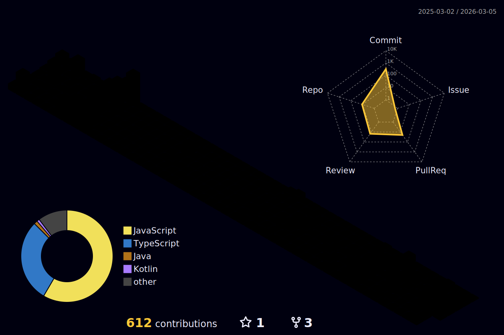

<h1 align="center">
  Hi 👋 I'm Danuka Nalindu
</h1>

<h3 align="center">
  🚀 Innovation Seeker | 👨‍💻 Full-Stack Developer | 🌟 Technology Enthusiast
</h3>

  

 

  

---

### 👨‍💻 About Me

- 🌱 Currently expanding my expertise in **Angular.js**, **Next.js**, **Node.js**, **Python**, and **Swift**
- 🧠 Passionate about building scalable, efficient, and user-centric applications
- 🏆 Driven by curiosity, continuous learning, and innovation
- 🌍 Traveler | 🎮 Gamer | 🎥 Movie Enthusiast | 🎧 Metalhead | 📚 Lifelong Learner

---

### 📬 Let's Connect

- 📧 Email: **danukanalidu2002@gmail.com**

---
<!--

   
  
   
   

 -->

  
  

<picture>
  <source media="(prefers-color-scheme: dark)" srcset="./assets/catsjuice-dark.svg">
  
</picture>

<!-- <a href="https://github.com/CatsJuice/ssr-contributions-img">
   <picture>
    <source media="(prefers-color-scheme: dark)" srcset="https://ssr-contributions-svg.vercel.app/_/CatsJuice?chart=3dbar&gap=0.6&scale=2&flatten=2&animation=wave&animation_duration=4&animation_delay=0.06&animation_amplitude=24&animation_frequency=0.1&animation_wave_center=0_3&format=svg&weeks=34&theme=native&dark=true">
    <source media="(prefers-color-scheme: light)" srcset="https://ssr-contributions-svg.vercel.app/_/CatsJuice?chart=3dbar&gap=0.6&scale=2&flatten=2&animation=wave&animation_duration=4&animation_delay=0.06&animation_amplitude=24&animation_frequency=0.1&animation_wave_center=0_3&format=svg&weeks=34&theme=native">
    
  </picture>
</a> -->

 

  

### 🔗 Connect with me:

 

### 🛠️ Languages and Tools:

<h3 align="left">Support Me:</h3>

  

